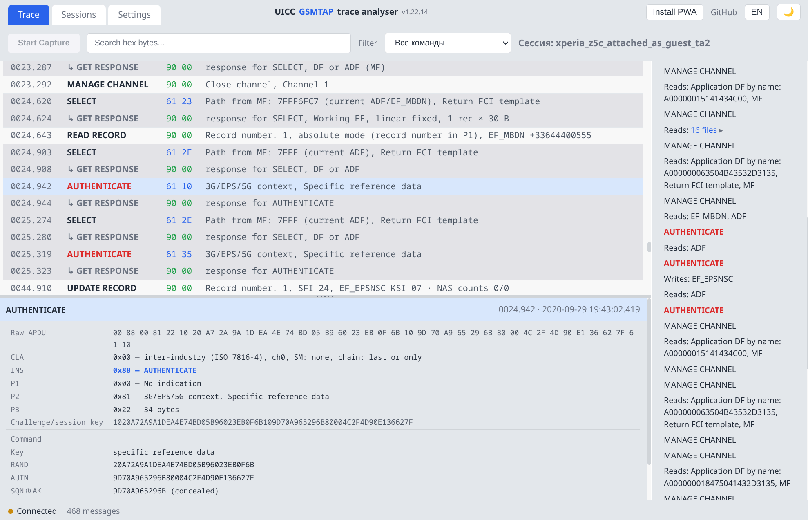

# SIMtrace Analyser

[English](README.md) | Русский

Анализатор APDU-трассировок в формате GSMTAP-SIM — захватывает обмен с
SIM/UICC из UDP-потока GSMTAP (или импортирует файлы PCAP/PCAPNG),
декодирует его и отдаёт устанавливаемое веб-приложение для просмотра.
В репозиторий также включён **simtrace2-pysniff** — замена `simtrace2-sniff`
на Python, которая захватывает трафик с оборудования Osmocom SIMtrace2
и может передавать GSMTAP этому анализатору.



## Компоненты

- **Анализирующий сервер + PWA** (`simtrace-analyser-server`) — сохраняет
  захваченный трафик в SQLite, декодирует его и отдаёт PWA
  ([`frontend/`](frontend/)) вместе с HTTP API на одном origin. Три режима
  захвата: GSMTAP-листенер, захват напрямую с оборудования SIMtrace2 или
  отключённый захват (только просмотр существующих записей).
- **Утилита захвата** (`simtrace2-pysniff`) — захватывает трафик
  оборудования SIMtrace2 и выводит его в stdout, GSMTAP (Wireshark) или
  PCAP-файлы. Это один из нескольких источников GSMTAP, которые принимает
  анализатор (см. также
  [sigrok_iso7816_stream](https://github.com/anttro/sigrok_iso7816_stream)).
- **PWA** ([`frontend/`](frontend/)) — окно трассировки с декодированными
  APDU, SIM Toolkit, SMS и SCP80 OTA; сессии, импорт PCAP, интерфейс EN/RU.

## Возможности

**Декодер APDU** (на стороне сервера, отображается в PWA):

- Полное декодирование APDU — CLA по ISO 7816-4 / ETSI (логический канал,
  secure messaging, chaining команд), имена INS из таблицы спецификаций,
  учёт SFI в P1/P2 для READ/UPDATE BINARY и команд с записями
- Статусные слова — полный набор ISO 7816-4 плюс специфичные для UICC
  значения: `91XX` (ожидается proactive-команда), `62F1/F2/F3`,
  `63F1/F2` (больше данных), `9300` (SAT busy), `9850`, `9862–64`
- SIM Toolkit — SAT (GSM 11.14), CAT (TS 102 223) и USAT (TS 31.111):
  proactive-команды с декодированными квалификаторами, TERMINAL RESPONSE,
  ENVELOPE (Menu Selection, Call Control, SMS-PP download…); учитываются
  известные несоответствия старых карт, нераспознанные TLV сохраняются
- SMS TPDU — SMS-DELIVER/SUBMIT, метки времени SCTS, информационные
  элементы UDH
- SCP80 OTA secured packets — биты SPI (шифрование, требование/режим PoR,
  RC/CC/DS, счётчик), алгоритм KIc/KID + набор ключей, TAR, CNTR/PCNTR;
  декодирование Response Packet (PoR) по GET RESPONSE; **опциональная
  расшифровка на клиенте** зашифрованных пакетов — вставьте 3DES/AES-ключ
  карты в панели деталей, чтобы увидеть настоящие CNTR и защищённые данные
  приложения (ключ остаётся в браузере, только в памяти; зашифрованные
  в эфире CNTR/PCNTR/RC — это шифротекст, и они так и помечены); защищённое
  сообщение приложения декодируется как поток **C-APDU** (SELECT,
  UPDATE BINARY, …) с полной разбивкой CLA/INS/P1/P2/Lc/Le — сразу для
  открытого текста или после расшифровки для зашифрованных пакетов
- Разбор ATR (пересчёт тактовой частоты, Fi/Di, битовая маска T)
  и FCP/FCI TLV

**PWA SIMtrace Analyser** ([`frontend/`](frontend/)):

- Окно трассировки с режимами «Карта»/«Список» — proactive,
  TERMINAL RESPONSE, ENVELOPE и AUTH-команды выделяются в режиме карты
- Сессии с прямыми ссылками (`#session=N`), импорт PCAP
  (`.pcap/.pcapng/.cap`), поиск и фильтрация по типу
- Устанавливаемая PWA, тёмная тема, интерфейс на английском/русском

## Требования

- **Python 3.9+**
- **PyUSB** — `pip install pyusb` (нужен только для захвата с оборудования
  SIMtrace2; захват GSMTAP/UDP и импорт PCAP работают без него)
- **libusb** — системная библиотека, обычно уже есть в Linux; в Windows
  нужно заменить драйвер SIMtrace2
  (см. [Доступ к USB-устройству](#доступ-к-usb-устройству))
- **Оборудование SIMtrace2** с прошивкой в режиме *trace* (только для
  прямого захвата; VID `1d50`, PID `60e3`, USB class `ff`, subclass `01`).
  О сборке и прошивке trace-прошивки см.
  [проект SIMtrace2](https://gitea.osmocom.org/sim-card/simtrace2).

Других зависимостей нет. Вывод PCAP, GSMTAP и hex dump использует только
стандартную библиотеку Python.

## Установка

```sh
git clone https://github.com/anttro/simtrace-analyser.git
cd simtrace-analyser
pip install pyusb
```

Или установите пакет в своё окружение:

```sh
pip install -e .
# затем запуск: simtrace-analyser-server [opts]
# или:          simtrace2-pysniff [opts]
```

## Запуск

### Анализирующий сервер + PWA (`simtrace-analyser-server`)

Сохраняет захваченный APDU-трафик в SQLite и отдаёт его по HTTP вместе
со встроенной PWA **SIMtrace Analyser** (`frontend/`) на том же origin.
Три режима захвата:

```sh
# Слушать GSMTAP от simtrace2-pysniff (или оригинального simtrace2-sniff):
simtrace-analyser-server --capture gsmtap

# Захват напрямую с оборудования SIMtrace2 (внешний инструмент не нужен):
simtrace-analyser-server --capture direct

# Просмотр/анализ существующих записей без бэкенда захвата:
simtrace-analyser-server --capture disabled
```

Сервер пишет в stderr информацию о жизненном цикле захвата (каждая строка
с локальным временем): `Capture started` при старте, периодический
heartbeat `Capture alive: session=N messages=M bytes=B dropped=D`
и `Capture stopped` (либо `ERROR: capture thread stopped on error …`,
если поток захвата неожиданно умер). Неверно сформированные или не-SIM
датаграммы GSMTAP отбрасываются и считаются (`dropped`), а не молча
убивают захват. Интервал heartbeat по умолчанию 60 с, настраивается
через `--log-interval SECONDS`.

GSMTAP-листенер также принимает декодер **sigrok-iso7816-stream**
(https://github.com/anttro/sigrok_iso7816_stream) — пассивный SIM-сниффер
на базе FX2-логического анализатора, выдающий тот же формат GSMTAP-SIM
на UDP 4729. Его стандартные подтипы PPS-запроса/ответа (`0x02`/`0x03`)
декодируются как PPS, а пользовательские подтипы для событий линий RST/VCC
(`0x10`/`0x11`, добавлены для совместимости с тем проектом) — как временные
маркеры `RESET ASSERTED` / `RST de-asserted — ATR follows` и `VCC ON/OFF`;
сброс или пропадание питания корректно сбрасывает отслеживание выбранного
файла. Когда событие
RST несёт измеренную частоту CLK (декодер v1.9.0+, опциональное расширение
полезной нагрузки), следующий ATR получает частоту CLK, скорость передачи
данных и ETU, вычисленные из его TA1 Fi/Di
(`data_rate = clk_hz × D / F`); измерение потребляется ATR, поэтому
следующий ATR без сброса не получит устаревшую скорость (поздно пришедшее
измерение восстанавливается для «своего» ATR). GSMTAP-пакеты с флагом
десинхронизации `GSMTAP_FLAG_BAD_FCS` (устанавливается тем декодером при
нарушении кадрирования) отображаются в таймлайне как
помеченная/десинхронизированная запись, чтобы такие артефакты было легко
заметить при разборе, а не молча искажали декодирование.

Параметры сервера:

```
--host ADDR          адрес привязки HTTP (по умолчанию: 127.0.0.1)
--port PORT          порт HTTP-сервера (по умолчанию: 8081)
--db FILE            путь к базе SQLite (по умолчанию: ~/.simtrace-analyser/sessions.db)
--capture MODE       gsmtap | direct | disabled  (по умолчанию: gsmtap)
--gsmtap-port PORT   UDP-порт листенера GSMTAP (по умолчанию: 4729)
--web-dir PATH       каталог статических файлов PWA (по умолчанию: <repo>/frontend)
```

Затем откройте **http://127.0.0.1:8081/** в браузере — PWA отдаётся
сервером, поэтому UI и API используют один origin, и настройка
CORS/Private-Network-Access не требуется. Используйте `--web-dir PATH`,
чтобы отдавать другой каталог PWA (по умолчанию: `<repo>/frontend`).

### Размещённая PWA (лендинг)

Автономная копия PWA размещена на **https://simtrace.atroshin.ru**.
Это чистый фронтенд: укажите в нём (Settings → Server URL) адрес
локально запущенного `simtrace-analyser-server`.

> **Ограничение браузера:** когда PWA отдаётся с публичного HTTPS-хоста,
> доступ к локальному серверу (`http://127.0.0.1:8081`) требует двух
> вещей: сервер должен отправлять
> `Access-Control-Allow-Private-Network: true` (этот сервер отправляет),
> и браузер должен иметь разрешение на доступ к локальной сети —
> в Chrome/Edge/Vivaldi: Настройки сайта → Доступ к локальной сети →
> разрешить сайту (или принять запрос разрешения). Без разрешения
> браузера запрос к `127.0.0.1` блокируется ещё до отправки preflight.

### Утилита захвата (`simtrace2-pysniff`)

Захватывает трафик оборудования SIMtrace2 и выводит его в stdout, GSMTAP
(Wireshark) или PCAP-файлы. Это встроенная замена оригинального
инструмента Osmocom `simtrace2-sniff`.

Скрипт запуска `./sniff-start.sh` выполняет предварительную проверку прав
доступа к USB (при неудаче печатает инструкцию по установке udev-правила)
и затем запускает модуль Python. В Windows используйте `sniff-start.bat`
с теми же параметрами (проверка прав не требуется).

```sh
./sniff-start.sh
./sniff-start.sh --format timestamp
./sniff-start.sh --gsmtap 127.0.0.1:4729
./sniff-start.sh --pcap trace.pcap --format atr-time
```

Параметры также можно задавать через переменные окружения:

```sh
FORMAT=timestamp GSMTAP=127.0.0.1 ./sniff-start.sh
```

Кроссплатформенный запуск модуля:

```sh
python -m simtrace2_pysniff
python -m simtrace2_pysniff --format timestamp --gsmtap 127.0.0.1:4729
python -m simtrace2_pysniff --pcap trace.pcap
```

Если пакет установлен через `pip install -e .`, используйте консольный
скрипт напрямую:

```sh
simtrace2-pysniff --format atr-time
```

## Доступ к USB-устройству

Нужен для захвата с оборудования SIMtrace2 (утилита и режим
`--capture direct` сервера); для источников GSMTAP и PCAP не требуется.

### Linux

Для доступа к устройству SIMtrace2 без root нужно udev-правило.

```sh
sudo cp 70-simtrace2-pysniff.rules /etc/udev/rules.d/
sudo udevadm control --reload-rules
sudo udevadm trigger
```

Затем переподключите USB-кабель SIMtrace2. Правило использует
`TAG+="uaccess"` (ACL systemd-logind) — членство в группе и права на
запись для всех не нужны.

### Windows

В Windows нет libusb-совместимого драйвера для SIMtrace2. Используйте
[Zadig](https://zadig.akeo.ie/), чтобы заменить драйвер по умолчанию:

1. Скачайте и запустите **Zadig**
2. Подключите устройство SIMtrace2
3. Выберите его в выпадающем списке (VID `1D50`, PID `60E3` — "Osmocom SIMtrace 2")
4. Выберите **WinUSB** (или libusbK) как драйвер замены
5. Нажмите **Replace Driver** (однократная операция)

После этого `python -m simtrace2_pysniff` работает так же, как в Linux.

## Параметры CLI утилиты

```
python -m simtrace2_pysniff [OPTIONS]

  --format, -f FORMAT       Формат вывода (по умолчанию: hex)
                            hex       — обычный hex-дамп
                            timestamp — строки TPDU с префиксом [ЧЧ:ММ:СС.мс]
                            atr-time  — строки TPDU с префиксом [СССС.мс] от последнего ATR
  --gsmtap HOST[:PORT]      Отправлять ATR/TPDU как GSMTAP по UDP (порт по умолчанию 4729)
  --pcap FILE               Записывать перехваченные данные в PCAP для Wireshark
  --output, -o FILE         Записывать hex-дамп в файл
  --no-stdout               Не выводить hex-дамп в stdout
  --vendor HEX              USB vendor ID (по умолчанию: 0x1d50)
  --product HEX             USB product ID (по умолчанию: автоопределение)

Параметры восстановления:
  --no-reconnect            Выходить при отключении USB вместо переподключения
  --reconnect-delay-min SEC Минимальная задержка переподключения (по умолчанию: 1.0)
  --reconnect-delay-max SEC Максимальная задержка переподключения (по умолчанию: 30.0)
  --backoff-factor N        Множитель экспоненциальной задержки (по умолчанию: 1.5)
  --inactivity-timeout SEC  Переподключаться после N секунд тишины (по умолчанию: выключено)
```

## Форматы вывода

- **`hex`** (по умолчанию): обычный hex-дамп — `ATR: 3b 9e ...`,
  `TPDU: a0 a4 00 00 02 3f 00`
- **`timestamp`**: строки TPDU с локальным временем —
  `[14:32:05.123] TPDU: a0 a4 00 00 02 3f 00`
- **`atr-time`**: строки TPDU с секундами от последнего ATR —
  `[0001.234] TPDU: a0 a4 00 00 02 3f 00`

Сообщения, не являющиеся TPDU (ATR, PPS, изменения состояния карты, Fi/Di),
выводятся одинаково во всех форматах.

- **GSMTAP**: сообщения ATR и APDU по UDP (порт 4729) в Wireshark
- **PCAP**: сообщения ATR/TPDU как пакеты Ethernet/IP/UDP/GSMTAP,
  открываются в Wireshark

## Фоновый режим / демон

SIGHUP автоматически игнорируется, когда stdin не является терминалом
(т.е. при запуске в фоне или через канал). Сессии в терминале на переднем
плане по-прежнему обрабатывают SIGHUP обычным образом.

Для постоянной работы в фоне с выводом в файлы:

```sh
nohup ./sniff-start.sh --output /tmp/sniff.log &> /tmp/sniff-err.log &
# или
FORMAT=timestamp nohup python -m simtrace2_pysniff --output /tmp/sniff.log &> /tmp/sniff-err.log &
```

## Использование как библиотеки

```python
from simtrace2_pysniff import SniffSession

session = SniffSession(inactivity_timeout=30.0)
for msg in session.iter_messages():
    print(f"{msg.type}: {msg.data.hex()}")
```

## Восстановление

Утилита по умолчанию переживает сбросы оборудования, отключения кабеля
и зависания прошивки — она переподключается с экспоненциальной задержкой
(1с → 30с). Используйте `--inactivity-timeout`, чтобы также переподключаться
при «тихих» зависаниях прошивки.

## Связанные проекты

- **[simtrace2](https://gitea.osmocom.org/sim-card/simtrace2)** — вышестоящий
  проект оборудования/прошивки SIMtrace2, с которого утилита захвата
  снимает трафик.
- **[sigrok_iso7816_stream](https://github.com/anttro/sigrok_iso7816_stream)** —
  пассивный ISO 7816 сниффер на базе FX2LP, выдающий такой же поток
  GSMTAP-SIM на UDP 4729 (принимается GSMTAP-листенером этого проекта).
